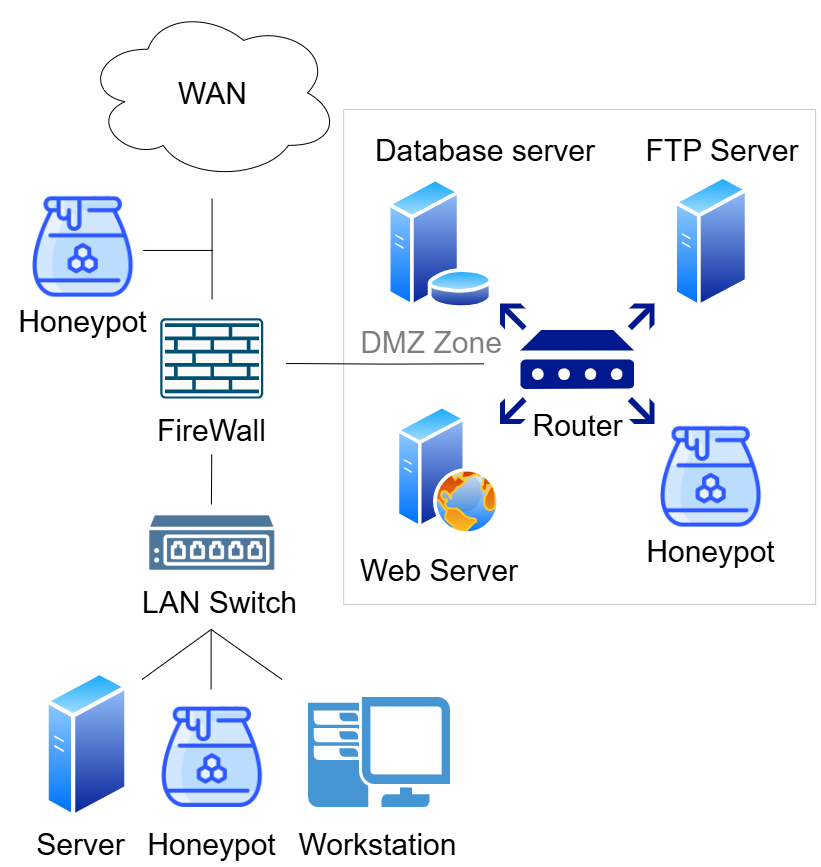
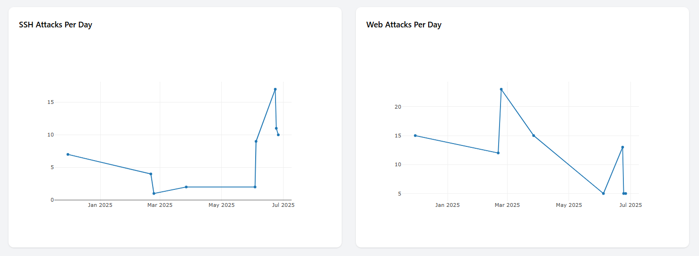

# 🛡️ Web & SSH Honeypot Project

  
  
 
   


---

> **A reproducible Web & SSH honeypot framework** for capturing, analyzing, and visualizing malicious activities in **web applications** and **Secure Shell (SSH)** services — with **real-time log visualization** and **ethical, legal compliance**.

---

## 📑 Table of Contents
<details>
<summary>Click to Expand</summary>

- [📜 Overview](#-overview)
- [🏗️ Architecture](#-architecture)
- [🔧 Features](#-features)
- [📊 Data Analysis](#-data-analysis)
- [📚 Benchmark Comparison](#-benchmark-comparison)
- [⚙️ Deployment](#-deployment)
- [🔬 Research Context](#-research-context)
- [📄 License](#-license)
- [📬 Contact](#-contact)

</details>

---

## 📜 Overview
Cyber threats are evolving rapidly, and honeypots remain a crucial proactive defense mechanism for **threat intelligence gathering**.

This project implements:
- **Web Honeypot** for emulating vulnerable web services.
- **SSH Honeypot** using Python’s `Paramiko` for SSHv2 session capture.
- **Real-Time Log Visualization Dashboard** to observe attack patterns as they happen.
- **VLAN-Isolated Virtual Lab Deployment** for safe experimentation.

Designed for **researchers** and **security practitioners**, this framework delivers actionable insights into attacker tactics, techniques, and procedures (TTPs).


---

## 🏗️ Architecture
The network supports **three potential honeypot placement points**:
1. **Network Perimeter (Before WAN)** — *Primary research focus*.
2. **Demilitarized Zone (DMZ)**.
3. **Internal LAN**.

In this study, the honeypot is positioned **at the network perimeter**, facing the WAN, to capture inbound attacks before they reach critical assets.  
All experiments are conducted **within an isolated VMware Workstation environment**.



---

## 🔧 Features
- **Web Honeypot** – Simulates exploitable web services.
- **SSH Honeypot** – Built on `Paramiko` with customizable command emulation.
- **Live Attack Dashboard** – Interactive visual analytics for:
  - IP frequency
  - Credential attempts
  - Session durations
- **Privacy-Compliant Data Retention** – Logs auto-purged according to policy.
- **Ethical & Legal Deployment** – No exposure to uncontrolled networks.

---

## 📊 Data Analysis
This honeypot logs and visualizes:
- Total **Web/SSH attack attempts**.
- **Username/password distributions**.
- **Attack frequency** per source IP.
- **Session durations**.
- **Command execution patterns**.

Example real-time dashboard:



---

## 📚 Benchmark Comparison
The research includes a **comparison of major honeypot systems** such as **Cowrie, Dionaea, T-Pot, Honeyd**, evaluated across:
- Interaction levels
- Deception techniques
- Analytics integration
- Deployment scenarios

Also discussed are **recent advances** like:
- **Containerized Decoys**
- **SOAR Integration**
- **ML-Based Anomaly Detection**

---

## ⚙️ Deployment

### Requirements
- Python 3.10+
- VMware Workstation (Optional) / Equivalent Code Execution platform (e.g. VSCode)
- VLAN isolation
- Default-deny firewall configuration (Optional)

# Quick Start
## 🚀 Installation & Run (Step-by-Step)

> **Prereqs:** Windows + VS Code (or any terminal), **Python 3.10.18**

### 1) Clone repository
```bash
git clone https://github.com/Vincentaun/Honeypot_Project.git
cd Honeypot_Project
```

### 2) Verify Python version = 3.10.18
```bash
python --version
# Expected: Python 3.10.18
```

### 3) Activate virtual environment
> If you already have an env, activate it:

`Your_Env\Scripts\activate` or \activate.ps1 or \activate.bat

**VSCode Command Prompt**
```VSCode
.\Honeypot_env\Scripts\activate
```

**PowerShell**
```powershell
.\Honeypot_env\Scripts\Activate.ps1
```

**Command Prompt (cmd)**
```cmd
Honeypot_env\Scripts\activate.bat
```

*(If you need to create it first, run: `python -m venv Honeypot_env` and then activate as above.)*

### 4) Run the program
> Use quotes because the folder name contains spaces and `&`.

**PowerShell**
```powershell
python ".\VABank (SSH & Web Honeypot)\Final_WebSSH_honeypot.py"
```

**Command Prompt (cmd)**
```cmd
python ".\VABank (SSH & Web Honeypot)\Final_WebSSH_honeypot.py"
```

### 5) Test via Webpage or SSH
**Web (replace PORT if different)**
```bash
# From the same machine:
curl http://127.0.0.1:5000/

# From another host on the network:
curl http://<HONEYPOT_IP>:5000/
```

**SSH (replace PORT if different)**
```bash
ssh -p 22 testuser@<HONEYPOT_IP>
# Try sample credentials to generate events and verify logging.
```

> Logs and real-time events will appear in the console and your configured log directory. Use your web dashboard to visualize activity after generating a few requests.


## 🔬 Research Context
This project accompanies the paper:

**[Your Paper Title]**, *[Conference/Journal Name]*, 2025.  
DOI: [Insert DOI once available]

The work emphasizes **reproducibility**, **ethical/legal compliance**, and the **integration of custom log visualization tools**.

## 📄 License
Licensed under the **MIT License** — see [LICENSE](LICENSE).

## 📬 Contact
For collaborations or inquiries:  
**Name:** [Vincent]  
**Email:** [vincentaun123@gmail.com]  
**Affiliation:** Department of Computer Science & Information Engineering, Chang Jung Christian University

